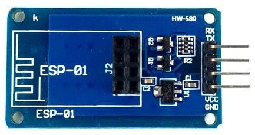
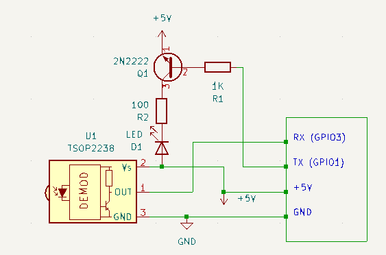
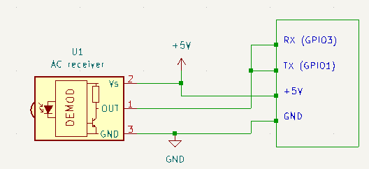

# Daikin_brc52A6x
Control of Daikin AC with both AC's remote and ESPHome(HA). This adds support for Daikin's BRC52A6x remote control but probably will work with minor changes for other remotes as well.

## The regular way using an IR receiver and an IR transmitter

For carrier frequency of 38kHz a TSOP2238 can be used like in the schematics below. I am using the ESP01S together with an adapter that allows using a 5V power supply and also can use 5V for input/output signals.



The connection of ESP to the receiver and transmitter looks like this:



When you build the ESPHome image you should have the transmitter defined in yaml file like below:
```
remote_transmitter:
  pin:
    number: GPIO1
    mode:
      output: true
  carrier_duty_percent: 50%
```
and the receiver defined linke this:
```
remote_receiver:
  id: ir_receiver 
  pin:
    number: GPIO3
    inverted: True
    mode:
      input: true
      pullup: true
  tolerance: 25%
```
Also you need to add an external repository where the new component implementing transmitter and receiver exists:
```
external_components:
  - source:
      type: git
      url: https://github.com/BogdanDIA/Daikin_brc52A6x/esphome/
      ref: main
    components: [ daikin_brc1 ]
    refresh: 0s
```

## The simplified way that do not use any additional HW for transmit and receive

This method uses the fact that the AC receiver's output is open drain and can be connected with both ESP's receiver and transmitter pins.



In this case the tranmitter should be defined like below where the output pin is mandatory to be open drain:

```
remote_transmitter:
  pin:
    number: GPIO1
    inverted: true
    mode:
      output: true
      open_drain: true
  carrier_duty_percent: 50%
```
We also need a modified version of the remote_transmitter component that is able to output demodulated signal directly so that it can be fed into the receiver:
```
external_components:
  - source:
      type: git
      url: https://github.com/BogdanDIA/Daikin_brc52A6x/esphome/
      ref: main
    components: [ daikin_brc1, remote_transmitter ]
    refresh: 0s
```

## Additional considerations
The TX and RX pins are connected to UART0 in ESP8266 processor. Therefore UART0 swap is needed so that the pins can be used as GPIO.
```
logger:
  hardware_uart: UART0_SWAP
```
The UART0 transmits briefly after boot until it is swapped by the ESPHome code. For that reason the TX (GPIO0) pin will go high state with push-pull enabled. However, this is not a problem as the 3V3-5V adapter is using on the 3.3V side a pull-up resistor when in high state and there is no risk on shorting the receiver output if in that brief moment it receives IR commands.

ESP8266 can be used with 5V IO directly as it is claimed to accept 5V on IO pins but not on the power. If a voltage level shifter is not used, probably it is a good idea to add a resistor from the ESP RX+TX to the ouput of AC's receiver.

You can find template yaml files in the example directory

## Daikin IR protocol
For those interested in the exact IR protocol exchanged at MARK/SPACE,bits,bytes level, you will can find a description of the protocol in the file protocol_BRC52A6X.txt
